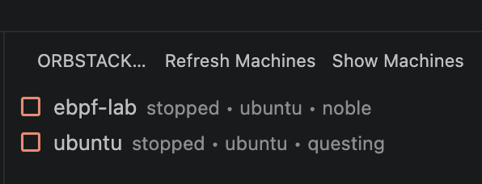
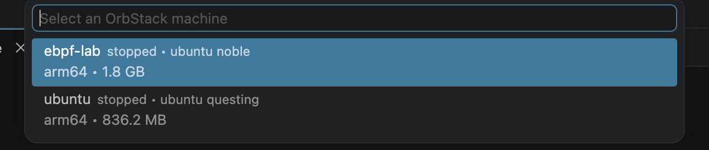

# OrbStack Toolkit

OrbStack Toolkit adds an OrbStack sidebar to VS Code so you can inspect local machines and run common actions without leaving the editor.

## Screenshots

### Extension View



### Show Machines Command



## Features

- Lists machines from the local `orb list` command
- Starts and stops machines from the tree or the command palette
- Opens an interactive shell into a selected machine
- Copies the machine IP when OrbStack reports one

## Requirements

- OrbStack installed locally
- The `orb` CLI available on your `PATH`

## Development

```bash
npm install
npm run compile
```

Press `F5` in VS Code to launch the extension host.

